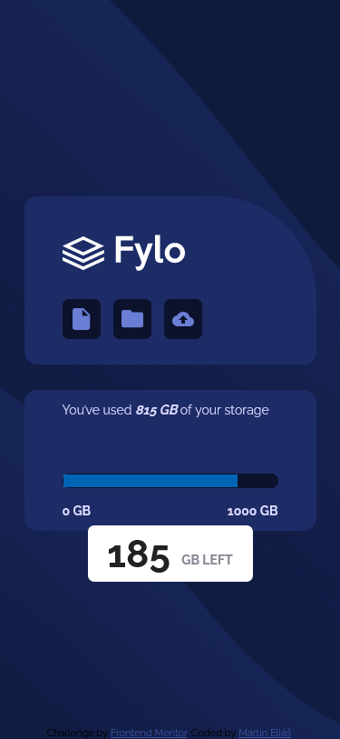
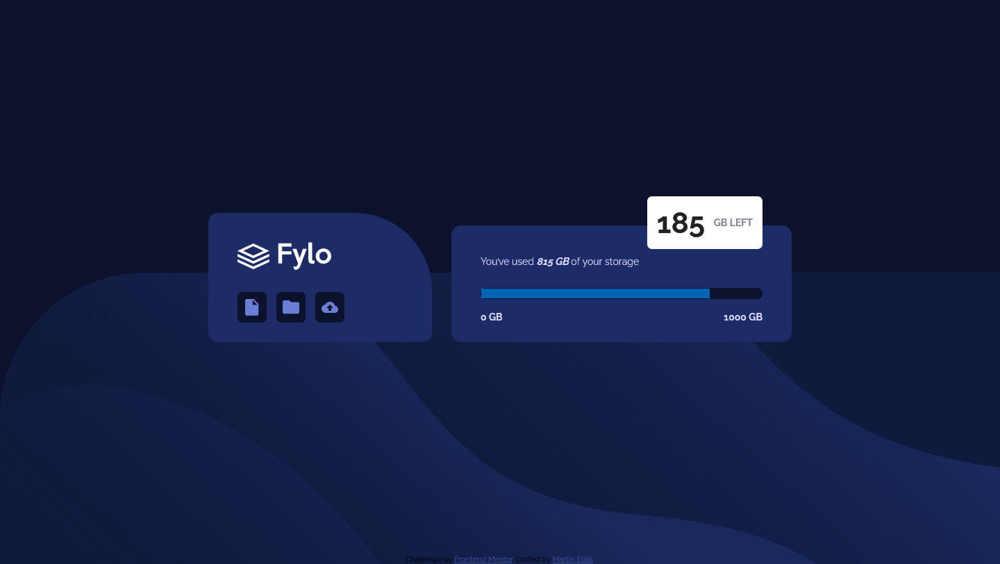

# Frontend Mentor - Fylo data storage component solution

This is a solution to the [Fylo data storage component challenge on Frontend Mentor](https://www.frontendmentor.io/challenges/fylo-data-storage-component-1dZPRbV5n). Frontend Mentor challenges help you improve your coding skills by building realistic projects. 

## Table of contents

- [Overview](#overview)
  - [The challenge](#the-challenge)
  - [Screenshot](#screenshot)
  - [Links](#links)
- [My process](#my-process)
  - [Built with](#built-with)
  - [Continued development](#continued-development)
- [Author](#author)

## Overview

### The challenge

Users should be able to:

- View the optimal layout for the site depending on their device's screen size

### Screenshot

  
  

### Links

- Solution URL: [https://www.frontendmentor.io/solutions/data-storage-component-with-flexbox-and-responsive-layout-AwIA-yZZQ](https://www.frontendmentor.io/solutions/data-storage-component-with-flexbox-and-responsive-layout-AwIA-yZZQ)
- Live Site URL: [https://fylo-data-storage-component-master-ten-phi.vercel.app/](https://fylo-data-storage-component-master-ten-phi.vercel.app/)

## My process

### Built with

- Semantic HTML5 markup
- CSS custom properties
- CSS variables
- Flexbox

### Continued development

I´ll continue to get better in creating responsive layout..

## Author

- Frontend Mentor - [@smradupan](https://www.frontendmentor.io/profile/smradupan)
- LinkedIn - [@Martin Eliáš](https://www.linkedin.com/in/martin-eli%C3%A1%C5%A1-455550209/)
